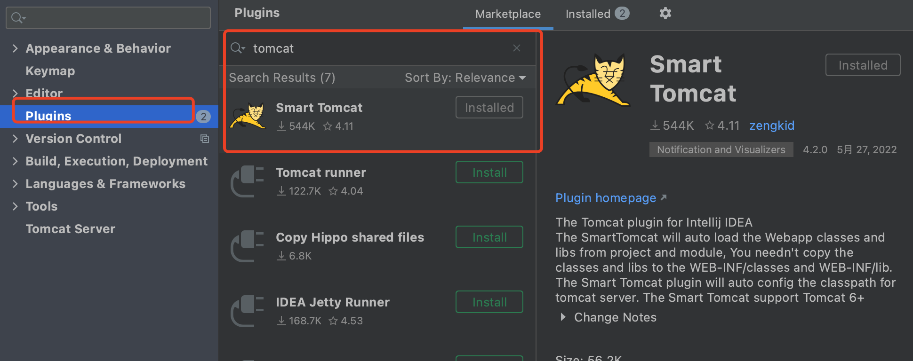
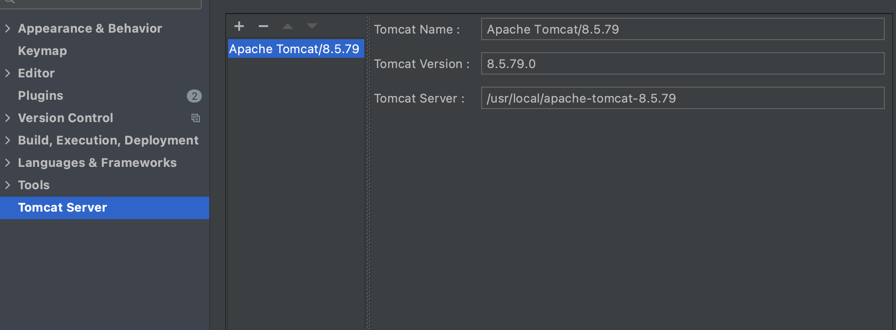
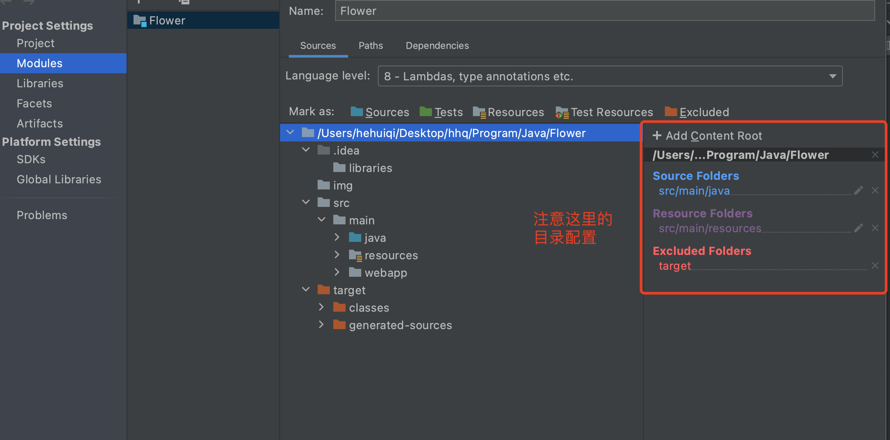
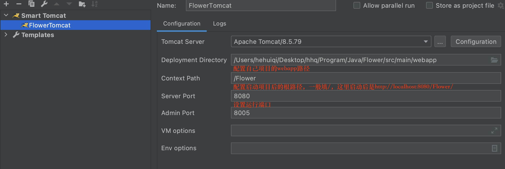

# Flower

## 项目开发环境
```
Mac OS 12.4
MySQL 8.0.20
Tomcat 8.5.7
```

## 数据库

## IDEA社区版运行

安装SmartTomcat插件

Preferences->Plugins->输入Smart Tomcat




配置Tomcat Server

Preferences->Tomcat Server


项目结构设置

File->Project Structure


配置项目tomcat准备运行

Run->Edit Configurations -> + > 选择 Smart Tomcat 




运行项目

Run->FlowerTomcat 将编译项目并启动服务器

此项目示例请求

http://localhost:8080/Flower/

http://localhost:8080/Flower/flower/home

http://localhost:8080/Flower/flower/time

http://localhost:8080/Flower/flower/food?name=noodles


